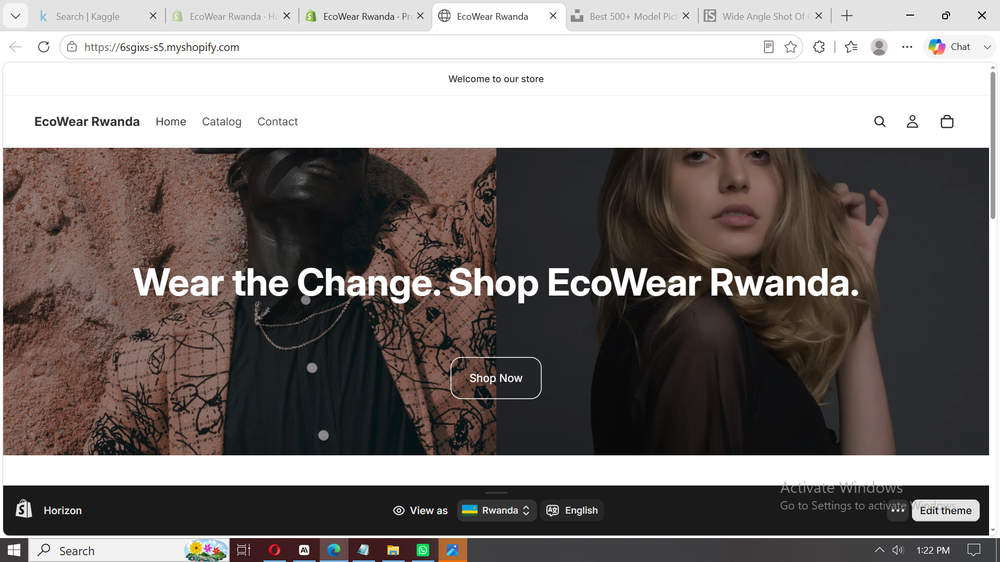
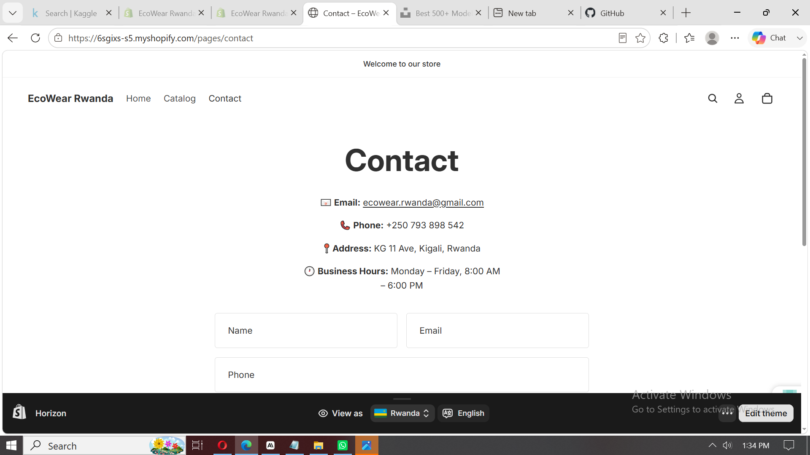

# 🛍️ EcoWear Rwanda — No-Code E-Commerce Project



---

## 👤 Students Information

| Field | Details |
|-------|---------|
| **Full Name** | Tony M. Dukuly | Joseph Seimien Mienwipiaz| Jamanda Janice Martin|
| **Course** | E-Commerce and Web Application — EWA408510 |
| **Lecturer** | Eric Maniraguha |
| **Academic Year** | 2025–2026 \| Semester II |
| **Institution** | University of Lay Adventists of Kigali (UNILAK) |
| **Submission Date** | June 08, 2026 |

---

## 📌 Project Title

**EcoWear Rwanda** — A sustainable fashion e-commerce store selling eco-friendly clothing and accessories made from locally sourced materials in Rwanda.

---

## 🛠️ Platform Used

**Shopify** — [shopify.com](https://www.shopify.com)

Shopify was selected for its powerful built-in e-commerce features including product management, cart functionality, and professional storefront templates — all without writing a single line of code.

---

## 🌐 Live Website Link

🔗 [https://6sgixs-s5.myshopify.com](https://6sgixs-s5.myshopify.com/)

---

## 💻 GitHub Repository Link

🔗 [https://github.com/madara590/ecowear-rwanda](https://github.com/madara590/ecowear-rwanda)

---

## ✅ Features Implemented

### Pages
- **Homepage** — Store name, welcome banner, featured products section, and call-to-action button
- **Product Page** — 6 products with images, prices, and full descriptions
- **About Page** — Store description, mission statement, and brand story
- **Contact Page** — Email address, phone number, and a working contact form
- **Cart Page** — Add-to-cart functionality with item count and order summary

### Functional Features
- ✅ Add to Cart button on every product
- ✅ Cart icon with live item counter in navigation
- ✅ Mobile-responsive design
- ✅ Navigation menu across all pages
- ✅ Footer with contact info and social links

---

## 🛒 Products Listed

| # | Product Name | Price (RWF) | Description |
|---|-------------|-------------|-------------|
| 1 | Kigali Linen Shirt | 18,000 | Breathable unisex shirt made from organic linen |
| 2 | Rwandan Wax Print Tote Bag | 9,500 | Handmade bag using traditional Rwandan wax fabric |
| 3 | Eco Cotton Hoodie | 25,000 | 100% organic cotton hoodie, locally stitched |
| 4 | Bamboo Fibre T-Shirt | 12,000 | Soft, sustainable bamboo-blend everyday tee |
| 5 | Upcycled Denim Jacket | 35,000 | Vintage-style jacket made from upcycled denim |
| 6 | Natural Dye Scarf | 7,500 | Handwoven scarf dyed with natural plant extracts |

---

## 📸 Screenshots

### Homepage


### Product Page


### Contact Page


---

## ⚙️ How I Built It — Step by Step

1. Created a free Shopify account at [shopify.com](https://shopify.com)
2. Selected the **Horizon** free theme and customized colors and banner image
3. Added the store name **EcoWear Rwanda** and configured store settings
4. Created all 6 products with images, prices, and descriptions under *Products > Add Product*
5. Built the **About Us** and **Contact** pages under *Online Store > Pages*
6. Customized the **Homepage** using the drag-and-drop editor — added hero banner image, featured collection, and welcome text
7. Enabled the **Contact Form** on the Contact page
8. Added inventory to all products to ensure they show as available
9. Published the store and copied the live link
10. Created this GitHub repository and wrote the README.md documentation

---

## 🚧 Challenges Faced

- **Product images**: Finding high-quality, free images that matched the eco-fashion theme required searching multiple free stock photo sites (Unsplash, Pexels).
- **"Sold out" labels**: Products initially showed as sold out because inventory was set to 0. Fixed by adding stock quantities to each product.
- **Theme customization**: Learning the Shopify theme editor took time — some sections were not immediately intuitive to rearrange.
- **Password protection**: Shopify's free trial password-protects the store by default, requiring a plan upgrade to make the live link publicly accessible.

---

## 📚 Lessons Learned

- No-code platforms like Shopify make it possible to launch a professional e-commerce store quickly without programming knowledge.
- Good product descriptions and quality images have a major impact on the look and credibility of an online store.
- GitHub Markdown (README.md) is a powerful tool for documenting projects in a clean, structured, and professional way.
- Planning the store layout and product catalogue before building saves significant time during development.
- E-commerce UX principles — clear navigation, visible cart, prominent call-to-action buttons — directly affect the customer experience.

---

## 📁 Repository Structure

```
ecowear-rwanda/
├── README.md          # Full project documentation
├── homepage.png       # Screenshot of homepage
├── product 1.png      # Screenshot of product page
└── contact.png        # Screenshot of contact page
```

---

> *"Your project is not just an assignment — it is part of your professional portfolio."*
> — Eric Maniraguha, UNILAK
